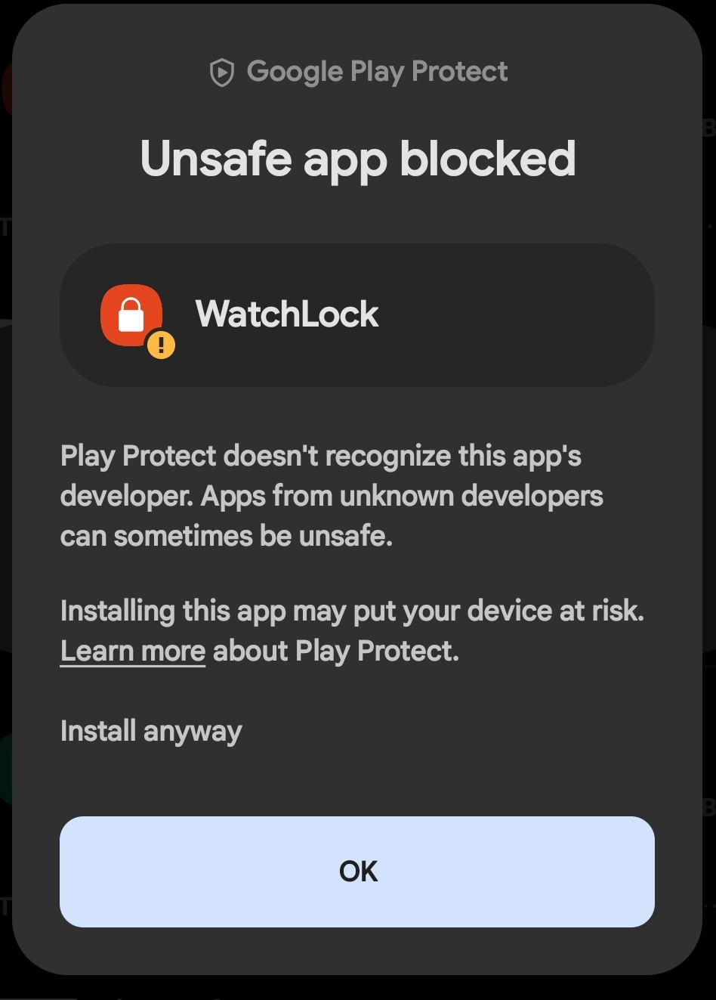
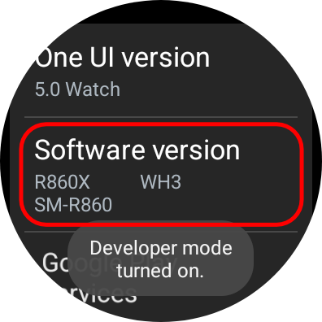
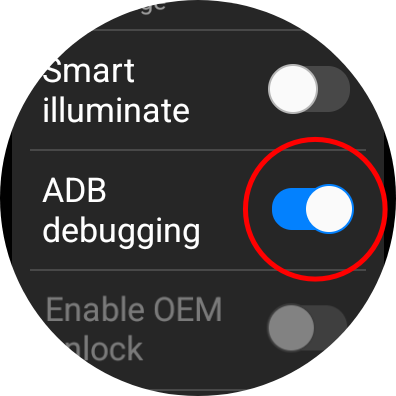
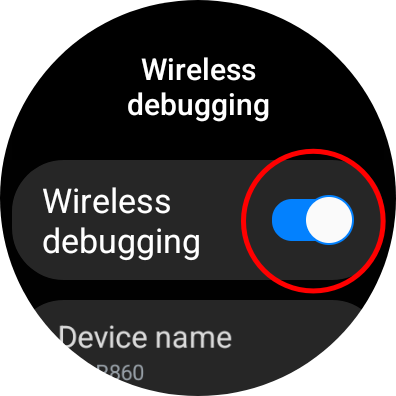
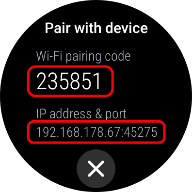
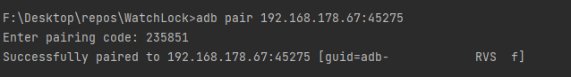
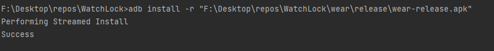
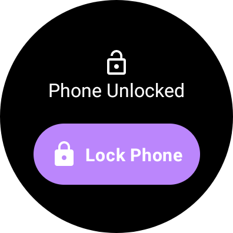

  
  <h3>
    Don't let people abuse your phone
  </h3>

  

## Features

- Lock your phone from your Watch
- View the if the phone is locked from your watch
- Dashboard on the mobile application to check if everything is working
- Support of dynamic colors (the application adapts the colors of the operating system)

Languages: English, German

**Tip: Bind double-tapping the home button to WatchLock so it opens the application.**

### Become a tester (places limited) 🚀💪

1. Join the official [Google Group](https://groups.google.com/g/watchlock)
2. Download WatchLock on [Google Play](https://play.google.com/store/apps/details?id=com.emilkrebs.watchlock)

---

# How to Install WatchLock on Android
1. Download the latest version of WatchLock on your phone from the [releases page](https://github.com/emilkrebs/WatchLock/releases/latest).
3. Open the apk-file and tap install.
   
You may get a security warning when installing the app. This is because the app is not signed by Google. You can safely ignore this warning by tapping "Install anyway".

 

# How to Install WatchLock on WearOS

## Watch Setup
1. Enable developer mode on your watch by tapping the software version in the settings app 5 times.

2. Enable ADB debugging in the developer settings.

3. Enable wireless debugging in the developer settings.

4. Pair a new device

## Computer Setup

1. Install ADB on your computer. You can find instructions [here](https://developer.android.com/tools/adb).
2. Connect your computer to the same network as your watch.
3. Run `adb pair <pairing address>` in a terminal.

## Install WatchLock 

1. Download the latest version of WatchLock from the [releases page](https://github.com/emilkrebs/WatchLock/releases/latest).
2. Run `adb install <path to apk>` in a terminal.

# Screenshots

Mobile

WearOS

